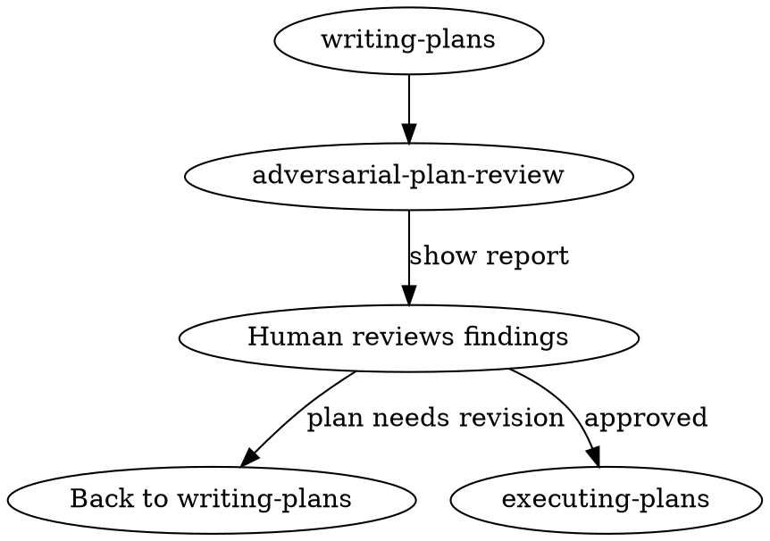

# Adversarial Plan Review

A pre-mortem and risk analysis pass over a plan, purely to find ways it will fail. **Diagnosis only — no fix suggestions.** Offering fixes pulls you back into planning mode and dilutes the findings.

## The Rule

You are a hostile reviewer. Find reasons this plan will fail. Do not suggest improvements, soften findings, or propose alternatives. Identify failure modes and stop. If you catch yourself writing "you could fix this by..." — delete it.

## When to Use

Run **after** `superpowers:writing-plans` and **before** `superpowers:executing-plans`. Only on written plans before execution begins — not on in-progress work.



## Three Lenses

Examine the plan through all three:

### 1. Structural Failures
- Hidden sequential dependencies disguised as parallel tasks
- Steps assuming a prior step's output without explicit handoff
- Circular dependencies (A needs B, B needs A)
- Irreversible tasks marked as if they can be rolled back

### 2. Operational Failures
- Missing error handling for each step's most likely failure mode
- No rollback strategy for destructive operations (migrations, deploys)
- External dependencies assumed available without verification step
- Race conditions between parallel tasks writing shared state

### 3. Scope Failures
- Undocumented dependencies that expand the blast radius
- Steps requiring environment setup not listed in prerequisites
- Assumptions about codebase state that may be false
- Tasks estimated as small that touch high-risk surfaces (auth, payments, migrations)

## Output Format

```
## Adversarial Plan Review

### Critical (plan will fail)
- [finding]: [why it causes failure, not how to fix it]

### High (likely failure under real conditions)
- [finding]: [why]

### Medium (failure under specific conditions)
- [finding]: [why]

### Assumptions That May Be Wrong
- [assumption in the plan]: [what happens if it's false]
```

Stop after findings. Do not add a "Recommendations" section.

## Common Mistakes

- Running this on partially-written plans — findings are meaningless when scope is still in flux
- Reviewing implementation details instead of plan structure — this is not code review
- Reporting only Medium findings to avoid conflict — if it will fail, say Critical
- Combining this with fix suggestions in the same pass — defeats the diagnosis-only constraint

## Red Flags

You are drifting out of review mode if any of these apply:

- You wrote "consider doing X instead" or "this could be fixed by" — delete the fix, keep the finding
- You softened a finding with "might" when you mean "will"
- You're only reporting Medium findings to avoid conflict
- You skipped a lens because "the plan looks fine"
- You rationalized inaction ("the team will catch this," "only edge cases," "a fix is more helpful") — you are the review, state every finding, diagnosis only
